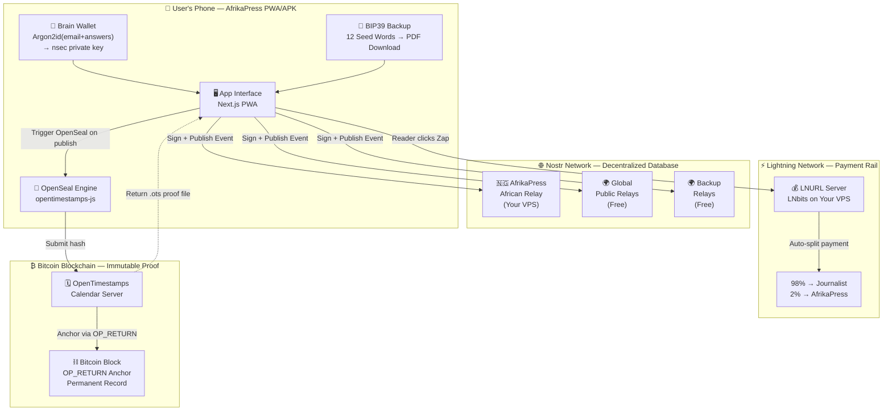

# 🏗️ AfrikaPress — Complete Implementation Plan (LOCKED)

> This is the final, locked architecture and build plan agreed upon after full brainstorming.
> All decisions in this document have been confirmed. Start coding from this document.

---

## 🔐 Locked Decisions Summary

| Decision | Chosen Approach | Reason |
| :--- | :--- | :--- |
| **Distribution** | PWA first → APK Phase 2 → F-Droid Phase 3 | Avoids Google/Apple censorship entirely |
| **Identity / Login** | Brain Wallet (Argon2id) + BIP39 12-word backup | Memorable for non-technical users in Africa |
| **Database** | None — Nostr relays are the database | Zero centralized backend, censorship-resistant |
| **Publishing** | Nostr protocol via NDK | Decentralized, uncensorable, signed by user's key |
| **Payments** | Lightning via NWC + automatic Zap Split (2% to AfrikaPress) | No banks, permissionless, transparent fee model |
| **Timestamping** | OpenTimestamps (OpenSeal feature) | Anchors proof to Bitcoin blockchain, free, open-source |
| **Backend** | One VPS ($10–20/month): Nostr relay + LNURL server | Minimal, cheap, only what is absolutely necessary |
| **Frontend** | Next.js (React) + TypeScript + Tailwind CSS | Fast, offline-capable PWA, well-supported ecosystem |
| **Language Support P1** | English + Nigerian Pidgin | Widest cross-tribal reach in Phase 1 |

---

## 🛠️ Tech Stack (Final)

### Frontend (The App)
| Library | Version | Purpose |
| :--- | :--- | :--- |
| `next` | 14+ | Framework — React-based PWA |
| `typescript` | 5+ | Type safety, fewer bugs |
| `tailwindcss` | 3+ | Styling — mobile first, low data usage |
| `@nostr-dev-kit/ndk` | latest | Nostr protocol — publishing, reading, signing |
| `nostr-tools` | latest | Key generation, BIP39 conversion, signing utilities |
| `@noble/hashes` | latest | Argon2id for Brain Wallet key derivation |
| `bip39` | latest | Convert private key ↔ 12 seed words |
| `opentimestamps` | latest | OpenSeal: Bitcoin timestamping |
| `next-pwa` | latest | PWA manifest, offline caching, install prompt |

### Backend (Minimal VPS — One Server Does Both)
| Software | Purpose | Cost |
| :--- | :--- | :--- |
| `nostr-rs-relay` | Fast African Nostr relay (Rust-based) | Free (open source) |
| `LNbits` | LNURL server + Zap Split logic | Free (open source) |
| **DigitalOcean Droplet** | Hosting the above | ~$12/month |

### Deployment
| Platform | Purpose |
| :--- | :--- |
| `Vercel` | Host the Next.js PWA frontend (free tier sufficient) |
| `Cloudflare` | DNS + DDoS protection for the relay |

---

## 📐 System Architecture



---

## 📱 Full App Blueprint — Screen by Screen

### SCREEN 0: Splash / Landing
- AfrikaPress logo + tagline: *"Publish without permission. Get paid without banks."*
- Two buttons: **"Create Account"** / **"I Already Have an Account"**

---

### SCREEN 1A: Create Account — Brain Wallet Setup
**Step 1 of 3 — Your Secret Questions**
```
"We do not store any of your answers.
These answers will ALWAYS recreate your account.
If you forget any answer, you lose access forever."

Email address:         [___________________]
Your mother's name:    [___________________]
A year you remember:   [___________________]
A secret word:         [___________________]

                            [ NEXT → ]
```
> Internally: `Argon2id(email|mothersName|year|secretWord, salt="afrikapress-v1")` → 32 bytes → Nostr `nsec` private key

**Step 2 of 3 — Your 12 Backup Words**
```
"Write these 12 words on paper OR download the PDF.
These words are a backup in case you forget your answers."

  1. abandon    2. ability    3. able
  4. about      5. above      6. absent
  7. absorb     8. abstract   9. absurd
 10. abuse     11. access    12. accident

[ 📥 Download PDF ]        [ I have saved them → ]
```

**Step 3 of 3 — Verify**
```
"What was word number 4?"    [ about ✅ ]
"What was word number 9?"    [ _______ ]

                            [ FINISH SETUP → ]
```

---

### SCREEN 1B: Login — Returning User (Two Methods)

**Method A: Brain Wallet (Preferred)**
```
Re-enter your secret answers to log in:
Email:          [_________]
Mother's name:  [_________]
Year:           [_________]
Secret word:    [_________]

                [ LOG IN → ]
```

**Method B: 12-Word Seed Phrase**
```
Enter your 12 backup words separated by spaces:
[                                              ]

                [ RESTORE ACCOUNT → ]
```

**Method C: Connect Existing Wallet (Advanced)**
```
[ 🔗 Connect with Alby / Nostr Extension ]
[ 🔗 Connect with NWC (Nostr Wallet Connect) ]
```

---

### SCREEN 2: Main Feed (Home)
```
┌─────────────────────────────────────────┐
│ AfrikaPress                    [ + Write ]│
├─────────────────────────────────────────┤
│ [ 📰 Stories ] [ 🗳️ Elections ] [ 👤 Me ]│
├─────────────────────────────────────────┤
│ ┌─────────────────────────────────────┐ │
│ │ 🔒 OpenSealed                       │ │
│ │ INEC alters results in Kogi State   │ │
│ │ @chidi_reporter · 2 mins ago        │ │
│ │ ⚡ 23 Zaps  💬 4 replies  ₿ Verified│ │
│ └─────────────────────────────────────┘ │
│ ┌─────────────────────────────────────┐ │
│ │ 🗳️ Election Report — Anambra South  │ │
│ │ PU 004: APC 120, PDP 340, LP 580    │ │
│ │ @observer_nwachukwu · 14 mins ago   │ │
│ │ ⚡ 11 Zaps  ₿ OpenSealed: Block 892k│ │
│ └─────────────────────────────────────┘ │
└─────────────────────────────────────────┘
```

---

### SCREEN 3: Write an Article
```
┌────────────────────────────────────────┐
│ ← Write Story                          │
├────────────────────────────────────────┤
│ Title:                                 │
│ [___________________________________]  │
│                                        │
│ Story:                                 │
│ [                                   ]  │
│ [   (Markdown supported)            ]  │
│ [                                   ]  │
│                                        │
│ [ 📎 Attach Photo ]                    │
│                                        │
│ ┌────────────────────────────────────┐ │
│ │ 🔏 OpenSeal this story on Bitcoin  │ │
│ │ [  ON  ] ← Recommended             │ │
│ │ "Creates permanent, tamper-proof   │ │
│ │  evidence of this publication."    │ │
│ └────────────────────────────────────┘ │
│                                        │
│         [ PUBLISH TO AFRIKAPRESS ]     │
└────────────────────────────────────────┘
```
> On publish: NDK signs the event → broadcasts to 5 relays → OpenSeal hashes and submits to OpenTimestamps → stores `.ots` proof file as Nostr event tag.

---

### SCREEN 4: Election Transparency Module
```
┌────────────────────────────────────────┐
│ ← 🗳️ Submit Polling Unit Result        │
├────────────────────────────────────────┤
│ State:      [ Select ▼ ]               │
│ LGA:        [ Select ▼ ]               │
│ Ward:       [___________________]      │
│ PU Number:  [___________________]      │
│                                        │
│ ┌──────────────────────────────────┐   │
│ │                                  │   │
│ │   [ 📷 TAKE PHOTO OF EC8A ]      │   │
│ │   (Point camera at result sheet) │   │
│ │                                  │   │
│ └──────────────────────────────────┘   │
│                                        │
│ ⚠️ OpenSeal is MANDATORY for election  │
│    submissions. Your photo will be     │
│    permanently timestamped on Bitcoin. │
│                                        │
│ Candidate Results (Optional — Manual): │
│ Party 1: [APC] Votes: [_____]         │
│ Party 2: [PDP] Votes: [_____]         │
│ Party 3: [LP ] Votes: [_____]         │
│                                        │
│      [ 📤 SUBMIT & OPENSEAL ]         │
└────────────────────────────────────────┘
```
> The photo is uploaded to IPFS or directly as a Nostr event. Results are stored as structured tags. OpenSeal runs automatically and is non-optional for this module.

---

### SCREEN 5: Reading an Article + Zapping
```
┌────────────────────────────────────────┐
│ ← [Article Title]                      │
│ @chidi_reporter · 45 mins ago          │
│ 🔒 OpenSealed: Bitcoin Block #892,341  │
│ [ ✅ Verify Proof ]                    │
├────────────────────────────────────────┤
│                                        │
│  [Article body text shown here]        │
│  [Photos displayed inline]             │
│                                        │
├────────────────────────────────────────┤
│                                        │
│  Support this journalist:              │
│                                        │
│  [ ⚡ 100 sats ] [ ⚡ 1,000 sats ]    │
│  [ ⚡ 5,000 sats ] [ ⚡ Custom ]       │
│                                        │
│  98% goes to journalist.               │
│  2% supports AfrikaPress platform.     │
│                                        │
└────────────────────────────────────────┘
```

---

### SCREEN 6: OpenSeal Verification
```
┌────────────────────────────────────────┐
│ 🔏 OpenSeal Verification               │
├────────────────────────────────────────┤
│ Paste an article link or Nostr ID:     │
│ [nostr:note1abc...]  [ VERIFY ]        │
├────────────────────────────────────────┤
│                                        │
│  ✅ VERIFIED                           │
│                                        │
│  "This article was published and       │
│   timestamped on:                      │
│                                        │
│   📅 February 26, 2027, 16:42 WAT     │
│   ₿  Bitcoin Block #892,341           │
│   🔗 [View on Block Explorer]          │
│                                        │
│   The content has NOT been altered     │
│   since it was first published."       │
│                                        │
└────────────────────────────────────────┘
```

---

### SCREEN 7: Journalist Profile
```
┌────────────────────────────────────────┐
│ @chidi_reporter                        │
│ Investigative journalist, Lagos        │
│ ⚡ chidi@afrikapress.app               │
├────────────────────────────────────────┤
│ 47 articles  |  312 Zaps received      │
│ 23 Election Reports OpenSealed         │
├────────────────────────────────────────┤
│ [ ⚡ Support This Journalist ]         │
├────────────────────────────────────────┤
│ Recent Articles:                       │
│  • [Article 1]                         │
│  • [Article 2]                         │
└────────────────────────────────────────┘
```

---

## 📁 Repository Folder Structure

```
afrikapress/
├── README.md                     ← Project overview, mission, how to contribute
├── LICENSE                       ← MIT License (required for HRF)
├── package.json
├── tsconfig.json
├── tailwind.config.ts
├── next.config.js                ← PWA configuration
│
├── public/
│   ├── manifest.json             ← PWA install manifest
│   ├── icons/                    ← App icons (all sizes for PWA)
│   └── sw.js                     ← Service worker (offline support)
│
├── src/
│   ├── app/                      ← Next.js App Router pages
│   │   ├── page.tsx              ← Landing / splash screen
│   │   ├── feed/page.tsx         ← Main article feed
│   │   ├── write/page.tsx        ← Article editor
│   │   ├── elections/page.tsx    ← Election module
│   │   ├── verify/page.tsx       ← OpenSeal verification screen
│   │   ├── profile/[npub]/page.tsx ← Journalist profile
│   │   └── auth/
│   │       ├── create/page.tsx   ← Brain Wallet setup
│   │       └── login/page.tsx    ← Login screen
│   │
│   ├── components/
│   │   ├── feed/
│   │   │   ├── ArticleCard.tsx
│   │   │   └── ElectionCard.tsx
│   │   ├── editor/
│   │   │   ├── ArticleEditor.tsx
│   │   │   └── OpenSealToggle.tsx
│   │   ├── elections/
│   │   │   ├── PhotoCapture.tsx
│   │   │   └── ResultsForm.tsx
│   │   ├── zap/
│   │   │   └── ZapButton.tsx
│   │   └── shared/
│   │       ├── LanguageSwitcher.tsx
│   │       └── OpenSealBadge.tsx
│   │
│   ├── lib/
│   │   ├── nostr/
│   │   │   ├── ndk.ts            ← NDK singleton setup + relay list
│   │   │   ├── publish.ts        ← Publish article/election to relays
│   │   │   └── fetch.ts          ← Read events from relays
│   │   ├── auth/
│   │   │   ├── brainwallet.ts    ← Argon2id key derivation logic
│   │   │   ├── bip39.ts          ← Seed phrase generation + PDF export
│   │   │   └── keystore.ts       ← Secure local key storage (localStorage encrypt)
│   │   ├── openseal/
│   │   │   └── timestamp.ts      ← OpenTimestamps hash + submit + verify
│   │   └── lightning/
│   │       └── zap.ts            ← NWC connection + Zap invoice generation
│   │
│   ├── locales/                  ← Language files
│   │   ├── en.json               ← English
│   │   └── pcm.json              ← Nigerian Pidgin
│   │
│   └── types/
│       └── nostr.ts              ← TypeScript types for Nostr events
│
└── relay/                        ← VPS configuration files
    ├── docker-compose.yml        ← Runs nostr-rs-relay + LNbits
    └── config.toml               ← Relay configuration
```

---

## 🚀 Phased Development Roadmap

### Phase 1: The MVP (Months 1–3) — HRF Grant Target ($10k–$12k)

#### Month 1 — Foundation
- [ ] Initialize Next.js + TypeScript + Tailwind project
- [ ] Configure `next-pwa` for offline support and "Add to Home Screen"
- [ ] Build Brain Wallet key derivation (`brainwallet.ts` using Argon2id)
- [ ] Build BIP39 seed phrase generation + PDF export (`bip39.ts`)
- [ ] Build Login screen (Brain Wallet + Seed Phrase methods)
- [ ] Set up NDK with 5 public relays + your African relay

#### Month 2 — Core Features
- [ ] Build the Article Editor screen with markdown support
- [ ] Implement Nostr publish flow (sign → broadcast to relays)
- [ ] Integrate OpenTimestamps (`openseal/timestamp.ts`)
- [ ] Build the Main Feed (reading articles from relays)
- [ ] Build the OpenSeal Verification screen

#### Month 3 — Payments + Election Module + Launch
- [ ] Implement NWC-based Zap button
- [ ] Set up LNbits on VPS with 2% Zap Split configured
- [ ] Build Election Transparency photo upload module
- [ ] Add Nigerian Pidgin language (`pcm.json`)
- [ ] Deploy to Vercel + configure custom domain (`afrikapress.app`)
- [ ] Onboard 20+ pilot journalists in Lagos/Abuja

---

### Phase 2: Privacy + Expansion (Months 4–6) — HRF Round 2 Target ($15k–$20k)

- [ ] Build Cashu eCash anonymous donation layer
- [ ] Integrate Machankura USSD API (SMS fallback for readers to Zap)
- [ ] Add Hausa language support (`ha.json`)
- [ ] Add Yoruba language support (`yo.json`)
- [ ] Build Android APK for direct download (bypass Play Store)
- [ ] Expand pilot to journalists in Kano, Port Harcourt, Abuja

---

### Phase 3: Resilience + Scale (Months 7–12) — HRF Round 3 / Self-sustaining

- [ ] Build Fedimint Emergency Legal Fund UI
- [ ] Launch on F-Droid (open-source Android store)
- [ ] Add French language for Francophone West Africa
- [ ] Partner with civil society orgs (Yiaga Africa, Paradigm Initiative, NUJ)
- [ ] Expand African relay infrastructure (Ghana, Kenya nodes)

---

## ✅ Verification Plan

### Before Calling Phase 1 "Done" — Manual Checklist
- [ ] A brand-new user can create an account using Brain Wallet (no email sent, no server involved)
- [ ] The same user can log out and log back in using the same 4 answers and get the same account
- [ ] The same user can log in using the 12 seed words instead
- [ ] A journalist can publish an article and see it appear on `primal.net` (external Nostr client)
- [ ] A reader can send a 100-sat Zap from a mobile Lightning wallet and the journalist receives it
- [ ] The 2% platform fee is visibly deducted and reaches the AfrikaPress Lightning address
- [ ] A published article's OpenSeal proof can be verified on `opentimestamps.org`
- [ ] The app installs as a PWA on Android Chrome and works offline (cached feed)
- [ ] An election photo upload is rejected without a location (State/LGA required)
- [ ] The entire app UI renders correctly in Nigerian Pidgin

### Automated Tests
- `brainwallet.ts` — same inputs always produce identical nsec key (deterministic test)
- `bip39.ts` — 12 words correctly regenerate the same private key
- `timestamp.ts` — hash of known string matches expected SHA-256 output
- NDK publish test — event successfully received by relay within 3 seconds
